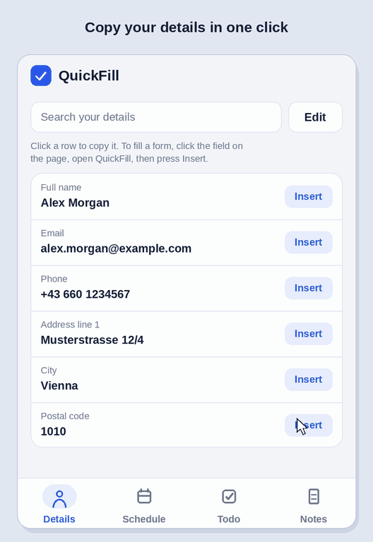

# QuickFill



A small Chrome extension that keeps the things you keep retyping one click away.
A Chrome extension that keeps the things you keep retyping one click away.

- **Details**: store your name, address, phone, email and any custom fields. Click to copy, or press **Insert** to fill the form field you selected.
- **Schedule**: upload a picture of your weekly class timetable and view it any time.
- **Todo**: a simple checklist.
- **Notes**: a plain text pad with a Save button (it also auto-saves).

## Install (developer mode)

1. Download or clone this repository.
2. Open `chrome://extensions` and enable **Developer mode**.
3. Click **Load unpacked** and choose this folder.
4. Pin QuickFill from the puzzle-piece menu.

Works in other Chromium browsers (Edge, Brave, Opera) the same way.

## Privacy

Everything is stored locally with `chrome.storage.local`. QuickFill makes no network requests, has no analytics and no server. Your data never leaves your browser.

## Permissions

| Permission | Why |
| --- | --- |
| `storage`, `unlimitedStorage` | Save your details, schedule image, todos and notes locally |
| `activeTab`, `scripting` | Insert a value into the form field you selected, only when you press Insert |

## Project structure

```
manifest.json   extension config (Manifest V3)
popup.html/css/js   the popup UI and logic
viewer.html/js      full-size schedule viewer
icons/              extension icons
```

## Contributing

Issues and pull requests are welcome. Ideas: backup/export of your data, multiple profiles, keyboard shortcuts, Firefox support.

## License

[MIT](LICENSE)


buymeacoffee.com/usmans.pk